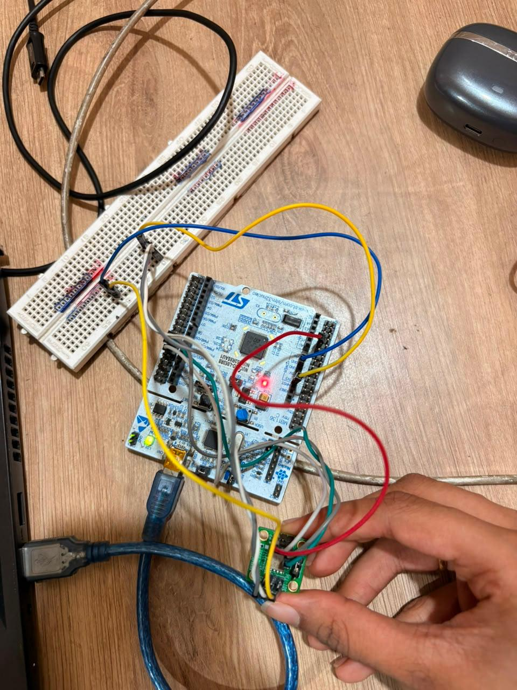

# High-Precision Industrial Tilt Monitoring System
### ADXL355 MEMS Accelerometer • STM32 NUCLEO-L053R8 • Python Industrial Dashboard

<p align="center">

</p>

<p align="center">


</p>

---

## 📑 Table of Contents

- Overview
- Dashboard Preview
- Project Demonstration
- Hardware Prototype
- Features
- System Architecture
- Hardware Specifications
- SPI Connections
- Firmware Workflow
- Dashboard Features
- Software Stack
- Project Structure
- Installation
- Applications
- Documentation
- Future Enhancements
- Author
- Acknowledgements

---

# 🚀 Overview

The **High-Precision Industrial Tilt Monitoring System** is an Industry Sponsored Project developed using the **Analog Devices ADXL355 20-bit MEMS Accelerometer**, **STM32 NUCLEO-L053R8**, and a **Python Industrial Dashboard**.

The firmware acquires acceleration data over SPI, computes roll and pitch, transmits processed values over UART, and visualizes them using a professional desktop dashboard with fixed-scale plots, CSV recording, statistics, and theme support.

---

# 🖥 Dashboard Preview

<p align="center">

</p>

**Figure 1.** Real-time industrial dashboard displaying sensor values, fixed-scale graphs, recording controls, communication status and statistics.

---

# 🎥 Project Demonstration

A complete demonstration video is included in:

```text
Demo/demo_video.mp4
```

The demonstration shows:

- Live STM32 ↔ ADXL355 SPI communication
- Real-time dashboard updates
- Roll & Pitch estimation
- Fixed-scale graphs
- Hardware prototype
- End-to-end system operation

---

# 🔧 Hardware Prototype

<p align="center">

</p>

**Figure 2.** Experimental setup consisting of the STM32 NUCLEO-L053R8, ADXL355 evaluation board and desktop monitoring application.

---

# ⭐ Key Features

## Embedded Firmware

- STM32 HAL Firmware
- ADXL355 Driver
- SPI Communication
- UART Streaming
- Roll & Pitch Calculation
- Digital Filtering
- Calibration Support

## Industrial Dashboard

- Fixed-scale graphs
- Live X/Y/Z monitoring
- Roll & Pitch display
- CSV recording
- Session statistics
- Dark / Light theme
- Professional industrial interface

---

# 🏗 System Architecture

```text
        ADXL355
           │
      4-Wire SPI
           │
 STM32 NUCLEO-L053R8
           │
     UART @115200
           │
 Python Industrial Dashboard
           │
 Live Visualization & CSV Export
```

---

# 🔌 Hardware Specifications

| Component | Description |
|-----------|-------------|
| MCU | STM32 NUCLEO-L053R8 |
| Sensor | ADXL355 Evaluation Board |
| Interface | SPI |
| Host Interface | UART |
| Dashboard | Python (PyQt5) |

---

# 🔗 SPI Connection Table

| STM32 Pin | ADXL355 |
|-----------|----------|
| PA4 | CS |
| PA5 | SCLK |
| PA6 | MISO |
| PA7 | MOSI |
| 3.3V | VDDIO |
| 3.3V | VDD |
| GND | GND |

---

# 🔄 Firmware Workflow

```text
Power On
 ↓
GPIO Init
 ↓
SPI Init
 ↓
UART Init
 ↓
Configure ADXL355
 ↓
Acquire X,Y,Z
 ↓
Convert to g
 ↓
Calculate Roll & Pitch
 ↓
Transmit UART
 ↓
Dashboard Visualization
```

---

# 🧮 Mathematical Model

Acceleration:

```text
Acceleration = Raw Counts × Sensor Sensitivity
```

Pitch:

```text
Pitch = atan2(X, √(Y² + Z²))
```

Roll:

```text
Roll = atan2(Y, √(X² + Z²))
```

---

# 💻 Software Stack

### Firmware

- STM32CubeIDE
- STM32 HAL
- Embedded C

### Dashboard

- Python
- PyQt5
- PyQtGraph
- NumPy
- PyOpenGL
- ReportLab

---

# 📂 Repository Structure

```text
Industrial-Tilt-Monitoring-System-STM32-ADXL355
│
├── Firmware/
├── Dashboard/
├── Images/
│   ├── project_banner.png
│   ├── dashboard.png
│   ├── hardware_prototype.png
│
├── Documentation/
│   ├── Technical_Report.pdf
│   └── adxl355_reference_schematic.png
│
├── README.md
├── LICENSE
└── .gitignore
```

---

# ⚙ Installation

```bash
git clone https://github.com/Aakash03122005/Industrial-Tilt-Monitoring-System-STM32-ADXL355.git

cd Industrial-Tilt-Monitoring-System-STM32-ADXL355/Dashboard

pip install -r requirements.txt

python main.py
```

---

# 🌍 Applications

- Structural Health Monitoring
- Bridge Monitoring
- Industrial Machine Alignment
- Building Tilt Monitoring
- Robotics
- Geotechnical Monitoring
- Industrial Automation

---

# 📚 Documentation

Documentation included:

- Technical Report
- ADXL355 Reference Schematic

```text
Documentation/
├── Technical_Report.pdf
└── adxl355_reference_schematic.png
```

---

# 🚀 Future Enhancements

- FFT Analysis
- 3D Orientation Visualization
- MQTT Support
- CAN Bus
- LoRa Connectivity
- Mobile Application
- TinyML Integration

---

# 👨‍💻 Author

**Aakash Dabhade**

B.Tech Electronics & Telecommunication Engineering

Vishwakarma Institute of Technology, Pune

Industry Sponsored Project — TDCoB Pvt. Ltd.

---

# 🙏 Acknowledgements

- TDCoB Pvt. Ltd.
- Vishwakarma Institute of Technology
- Analog Devices
- STMicroelectronics

---

# ⭐ Support

If you found this repository useful, please consider **starring ⭐ the repository**.
