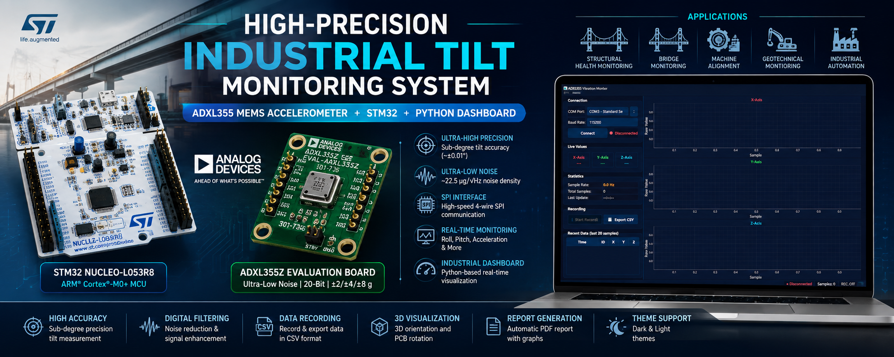
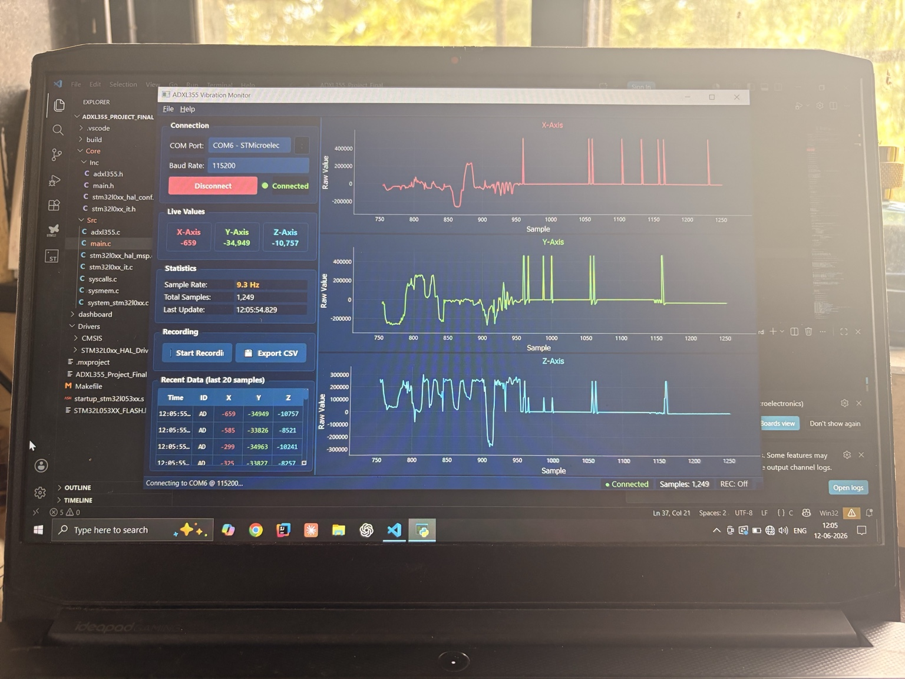

# High-Precision Industrial Tilt Monitoring System
### ADXL355 MEMS Accelerometer + STM32 NUCLEO-L053R8 + Python Industrial Dashboard

<p align="center">


</p>

---

<p align="center">

</p>

---

# Overview

The **High-Precision Industrial Tilt Monitoring System** is a real-time embedded monitoring solution developed using the **Analog Devices ADXL355 Ultra-Low Noise MEMS Accelerometer** and the **STM32 NUCLEO-L053R8** development board.

The system continuously measures structural inclination by acquiring ultra-high-resolution acceleration data from the ADXL355 through the SPI interface. The embedded firmware processes the raw sensor values, computes accurate **Roll** and **Pitch** angles, and transmits the processed measurements to a professional **Python-based Industrial Dashboard** over UART.

The desktop application provides real-time visualization, fixed-scale industrial graphs, live statistics, CSV recording, multiple visualization modes, and an intuitive user interface suitable for industrial demonstrations and monitoring applications.

This project was successfully completed as an **Industry Sponsored Project** under **TDCoB Pvt. Ltd.**

---

# Dashboard Preview

<p align="center">

</p>

<p align="center">
<b>Figure 1.</b> Industrial Monitoring Dashboard displaying real-time tilt measurements, fixed-scale graphs, live parameters, communication status, statistics, and data recording.
</p>

---

# Project Highlights

- High-Precision Tilt Measurement
- Industrial Embedded System
- ADXL355 Ultra-Low Noise MEMS Accelerometer
- STM32 HAL-Based Firmware
- SPI Communication
- UART Telemetry
- Real-Time Roll & Pitch Estimation
- Fixed Scale Industrial Graphs
- Professional Python Dashboard
- CSV Recording
- Dark & Light Theme Support
- Complete Technical Documentation Included

---

# Project Objectives

- High-Precision Tilt Measurement
- Structural Health Monitoring (SHM)
- Bridge Monitoring
- Industrial Machine Alignment
- Building Inclination Monitoring
- Geotechnical Monitoring
- MEMS Sensor Research
- Industrial Dashboard Development

---

# Key Features

## Embedded System

- STM32 HAL Firmware
- ADXL355 Driver
- SPI Communication
- UART Communication
- GPIO Configuration
- Sensor Initialization
- Real-Time Data Acquisition
- High-Speed Sampling

---

## Industrial Dashboard

- Real-Time Sensor Monitoring
- Fixed Scale Graphs
- Roll & Pitch Display
- Live Statistics
- CSV Recording
- Automatic COM Detection
- Dark Theme
- Light Theme
- Industrial User Interface

---

## Data Processing

- Raw Sensor Acquisition
- Acceleration Conversion
- Tilt Angle Calculation
- Calibration Support
- Digital Filtering
- Noise Reduction

---

# System Architecture

```text
                +----------------------------+
                |      ADXL355 Sensor        |
                | 20-bit MEMS Accelerometer  |
                +-------------+--------------+
                              |
                         SPI Interface
                              |
                +-------------v--------------+
                | STM32 NUCLEO-L053R8 MCU    |
                | Embedded Firmware (HAL)    |
                +-------------+--------------+
                              |
                       UART (115200 Baud)
                              |
                +-------------v--------------+
                | Python Industrial Dashboard|
                | Live Monitoring & Logging  |
                +-------------+--------------+
                              |
                    CSV Export & Visualization
```

---

# Hardware Components

| Component | Description |
|------------|-------------|
| STM32 NUCLEO-L053R8 | ARM Cortex-M0+ Development Board |
| ADXL355 Evaluation Board | Ultra-Low Noise 20-bit MEMS Accelerometer |
| ST-Link | Programming & Debugging |
| USB Cable | Power & UART Communication |
| PC | Python Dashboard |

---

# Hardware Interface

The system uses the SPI interface between the STM32 and the ADXL355 Evaluation Board.

## SPI Connection Table

| STM32 Pin | ADXL355 Evaluation Board |
|------------|--------------------------|
| PA4 | P2 Pin 1 (CS) |
| PA5 | P2 Pin 2 (SCLK) |
| PA6 | P2 Pin 3 (MISO) |
| PA7 | P2 Pin 4 (MOSI) |
| 3.3V | P1 Pin 1 (VDDIO) |
| 3.3V | P1 Pin 3 (VDD) |
| GND | P1 Pin 5 (GND) |

---

## ADXL355 Evaluation Board Headers

### P1 Header (Power)

| Pin | Description |
|------|-------------|
| Pin 1 | VDDIO (3.3V) |
| Pin 2 | INT1 |
| Pin 3 | VDD (3.3V) |
| Pin 4 | INT2 |
| Pin 5 | GND |
| Pin 6 | DRDY |

---

### P2 Header (SPI)

| Pin | Description |
|------|-------------|
| Pin 1 | CS |
| Pin 2 | SCLK |
| Pin 3 | MISO |
| Pin 4 | MOSI |
| Pin 5 | Reserved |
| Pin 6 | Reserved |

---

The official Analog Devices evaluation board schematic used during development is included in:

```
Documentation/adxl355_reference_schematic.png
```

---

# Firmware Workflow

```text
Power ON
    │
GPIO Initialization
    │
SPI Initialization
    │
UART Initialization
    │
ADXL355 Configuration
    │
Read 20-bit Raw Data
    │
Acceleration Conversion
    │
Roll & Pitch Calculation
    │
UART Transmission
    │
Python Dashboard
    │
CSV Recording
```

---

# UART Packet Format

```text
ID=AD,X=12345,Y=-5678,Z=245678
```

---

# Mathematical Model

## Acceleration Conversion

```
Acceleration = Raw Counts × Sensor Sensitivity
```

---

## Pitch

```
Pitch = atan2(X, √(Y² + Z²))
```

---

## Roll

```
Roll = atan2(Y, √(X² + Z²))
```

---

# Noise Reduction

The firmware incorporates several signal conditioning techniques:

- Offset Calibration
- Scale Calibration
- Digital Low Pass Filtering
- Moving Average Filtering
- Sensor Noise Reduction
- Calibration Compensation

---

# Software Stack

## Embedded Firmware

- STM32CubeIDE
- STM32 HAL Drivers
- Embedded C
- SPI Driver
- UART Driver
- GPIO Driver

---

## Desktop Dashboard

- Python 3.x
- PyQt5
- PyQtGraph
- NumPy
- PyOpenGL
- ReportLab

---

# Repository Structure

```text
Industrial-Tilt-Monitoring-System-STM32-ADXL355/

│
├── Core/
├── Drivers/
├── dashboard/
│
├── Images/
│     ├── project_banner.png
│     └── dashboard.png
│
├── Documentation/
│     ├── Technical_Report.pdf
│     └── adxl355_reference_schematic.png
│
├── Makefile
├── README.md
└── LICENSE
```

---

# Installation

Clone the repository

```bash
git clone https://github.com/YOUR_USERNAME/Industrial-Tilt-Monitoring-System-STM32-ADXL355.git
```

Navigate to the project

```bash
cd Industrial-Tilt-Monitoring-System-STM32-ADXL355
```

Install dashboard dependencies

```bash
cd dashboard

pip install -r requirements.txt
```

Run the dashboard

```bash
python main.py
```

---

# Applications

- Structural Health Monitoring
- Industrial Automation
- Bridge Monitoring
- Building Inclination Monitoring
- Machine Alignment
- Robotics
- MEMS Sensor Research
- Geotechnical Monitoring

---

# Future Enhancements

- FFT Frequency Analysis
- 3D Orientation Visualization
- SD Card Logging
- MQTT Cloud Dashboard
- CAN Bus Support
- LoRa Communication
- TinyML Integration
- Predictive Maintenance
- Mobile Dashboard

---

# Documentation

A comprehensive technical report is included with the repository.

The report contains:

- Project Overview
- Literature Survey
- Hardware Design
- SPI Interface
- ADXL355 Evaluation Board
- Embedded Firmware
- Mathematical Modeling
- Dashboard Architecture
- Experimental Results
- Applications
- Future Scope
- References

📄

```
Documentation/Technical_Report.pdf
```

The official Analog Devices ADXL355 Evaluation Board schematic is also included for hardware reference.

📄

```
Documentation/adxl355_reference_schematic.png
```

---

# Developed By

## **Aakash Dabhade**

**B.Tech Electronics & Telecommunication Engineering**

Vishwakarma Institute of Technology (VIT), Pune

Industry Sponsored Project

TDCoB Pvt. Ltd.

---

# Acknowledgements

Special thanks to

- TDCoB Pvt. Ltd.
- Vishwakarma Institute of Technology, Pune
- Analog Devices Inc.
- STMicroelectronics

---

## Repository Topics

```
stm32
adxl355
embedded-c
pyqt5
pyqtgraph
industrial-monitoring
mems
accelerometer
tilt-monitoring
structural-health-monitoring
spi
stm32cubeide
python
electronics
```

---

# ⭐ Support

If you found this project useful, please consider **starring ⭐ the repository**. It helps others discover the project and supports future development.

---
