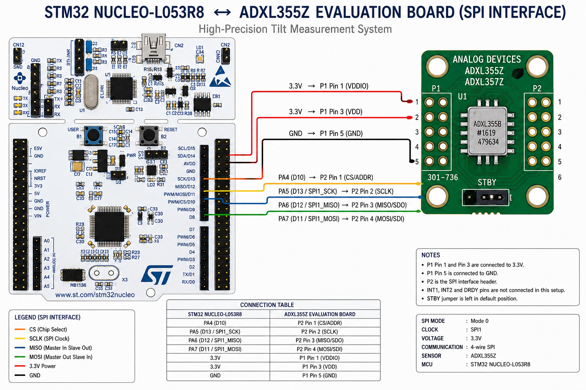

# High-Precision Industrial Tilt Monitoring System
### ADXL355 MEMS Accelerometer + STM32 + Python Industrial Dashboard

<p align="center">


</p>

---

# Overview

This project presents a **high-precision industrial tilt measurement system** developed using the **Analog Devices ADXL355 Ultra-Low Noise MEMS Accelerometer** and an **STM32 NUCLEO-L053R8 Microcontroller**.

The system continuously measures the inclination of a structure with **sub-degree precision** by acquiring raw acceleration data from the ADXL355 over SPI, processing it on the STM32, and visualizing the measurements using a real-time industrial desktop dashboard developed in Python.

The project was completed as an **Industry Sponsored Project** under **TDCoB Pvt. Ltd.**

---

# Project Objectives

- High precision tilt monitoring
- Structural Health Monitoring (SHM)
- Industrial machine alignment
- Bridge and building inclination monitoring
- Geotechnical monitoring
- Research in MEMS-based precision sensing
- Industrial dashboard development

---

# Features

✔ Ultra-Low Noise ADXL355 Accelerometer

✔ STM32 HAL Driver

✔ SPI Communication

✔ Real-Time UART Telemetry

✔ Industrial Python Dashboard

✔ Real-Time Graphs

✔ 3D Orientation Visualization

✔ FFT Frequency Analysis

✔ Session Recording

✔ Session Playback

✔ Automatic Report Generation

✔ Calibration Support

✔ Digital Filtering

✔ Noise Reduction

✔ Temperature Compensation

✔ High Accuracy Tilt Calculation

---

# System Architecture

```

            +----------------------------+
            |      ADXL355 Sensor        |
            | 20-bit MEMS Accelerometer  |
            +-------------+--------------+
                          |
                     SPI Interface
                          |
                          |
            +-------------v--------------+
            | STM32 NUCLEO-L053R8 MCU    |
            | HAL Driver + Processing    |
            +-------------+--------------+
                          |
                     UART (115200)
                          |
                          |
            +-------------v--------------+
            | Python Industrial Dashboard|
            | Live Graphs + 3D + FFT     |
            +-------------+--------------+
                          |
                   PDF Report Generator

```

---

# Hardware Components

| Component | Description |
|------------|------------|
| STM32 NUCLEO-L053R8 | ARM Cortex-M0+ MCU |
| ADXL355 Evaluation Board | Ultra-low noise MEMS accelerometer |
| ST-Link | Programming & Debugging |
| USB | Power + UART Communication |
| PC | Industrial Dashboard |

---

# Hardware Wiring



The complete SPI wiring diagram between the STM32 NUCLEO-L053R8 and the ADXL355 evaluation board is documented in the project report and wiring figure. :contentReference[oaicite:0]{index=0}

---

# SPI Connection Table

| STM32 | ADXL355 |
|---------|----------|
| PA4 | CS |
| PA5 | SCLK |
| PA6 | MISO |
| PA7 | MOSI |
| 3.3V | VDD |
| 3.3V | VDDIO |
| GND | GND |

---

# Software Stack

## Embedded Firmware

- STM32CubeIDE
- STM32 HAL Drivers
- SPI Driver
- UART Driver
- GPIO Driver
- ADXL355 Driver

---

## Desktop Dashboard

Python Technologies

- PyQt5
- PyQtGraph
- NumPy
- PyOpenGL
- ReportLab

---

# Folder Structure

```

Industrial-Tilt-Monitoring-System/

│

├── Firmware/

│ ├── Core/

│ ├── Drivers/

│ ├── Inc/

│ └── Src/

│

├── Dashboard/

│ ├── main.py

│ ├── serial_reader.py

│ ├── plotter.py

│ ├── fft_analysis.py

│ ├── gaugeview.py

│ ├── tilt3d.py

│ ├── report_generator.py

│ └── requirements.txt

│

├── Images/

│ ├── circuit_diagram.png

│ ├── dashboard.png

│ ├── hardware.jpg

│ └── graphs.png

│

├── Documentation/

│ └── Technical_Report.pdf

│

└── README.md

```

---

# Firmware Workflow

```

Initialize MCU

↓

Configure GPIO

↓

Initialize SPI

↓

Initialize UART

↓

Reset ADXL355

↓

Configure Measurement Mode

↓

Read 20-bit Raw Data

↓

Convert Raw Counts

↓

Apply Calibration

↓

Apply Low Pass Filter

↓

Calculate Roll & Pitch

↓

Transmit UART Packet

↓

Python Dashboard

```

---

# UART Packet Format

```

ID=AD,X=12345,Y=-5678,Z=256000

```

---

# Tilt Calculation

Acceleration Conversion

```

Acceleration = Raw × 3.9 µg/LSB

```

Pitch

```

θx = atan2(X, √(Y² + Z²))

```

Roll

```

θy = atan2(Y, √(X² + Z²))

```

---

# Noise Reduction Techniques

The firmware includes multiple filtering methods:

- Offset Calibration
- Scale Calibration
- Temperature Compensation
- Exponential Moving Average
- Sample Averaging
- Low Pass Filtering

These techniques significantly reduce sensor noise and improve tilt accuracy. :contentReference[oaicite:1]{index=1}

---

# Dashboard Features

✔ Live Roll & Pitch

✔ Live Acceleration

✔ FFT Analysis

✔ 3D PCB Rotation

✔ Health Indicator

✔ Industrial Gauges

✔ Session Recording

✔ Session Playback

✔ PDF Report Generation

✔ Dark Theme

✔ Light Theme

The report describes the dashboard architecture, including modules for real-time plotting, serial communication, FFT analysis, 3D visualization, configuration management, playback, notifications, and automated PDF reporting. :contentReference[oaicite:2]{index=2}

---

# Applications

- Structural Health Monitoring
- Bridge Monitoring
- Building Monitoring
- Machine Alignment
- Robotics
- Geotechnical Monitoring
- Seismic Monitoring
- Industrial Automation

These application areas are listed in the project report. :contentReference[oaicite:3]{index=3}

---

# Performance

| Parameter | Value |
|------------|--------|
| Sensor Resolution | 20-bit |
| Interface | SPI |
| Communication | UART |
| Voltage | 3.3V |
| MCU | STM32L053R8 |
| Sensor | ADXL355 |
| Accuracy | ±0.01° |
| Output | Roll, Pitch |

The report states that the system targets approximately ±0.01° tilt resolution after calibration and filtering. :contentReference[oaicite:4]{index=4} :contentReference[oaicite:5]{index=5}

---

# Future Improvements

- CAN Bus Support
- RS485 Communication
- LoRaWAN
- MQTT Cloud Dashboard
- Edge AI
- TinyML
- SD Card Logging
- WiFi Connectivity
- OTA Firmware Updates
- Mobile Application

---

# Documentation

Complete project report available inside:

```

Documentation/

```

The report covers hardware design, firmware, mathematical modeling, calibration, dashboard architecture, applications, and validation. :contentReference[oaicite:6]{index=6}

---

# Developed By

**Aakash Dabhade**

Electronics & Telecommunication Engineering

Vishwakarma Institute of Technology, Pune

Industry Sponsored Project

TDCoB Pvt. Ltd.

---

# Acknowledgements

- TDCoB Pvt. Ltd.
- Vishwakarma Institute of Technology, Pune
- STMicroelectronics
- Analog Devices Inc.

---

⭐ If you found this project useful, consider giving it a star!
