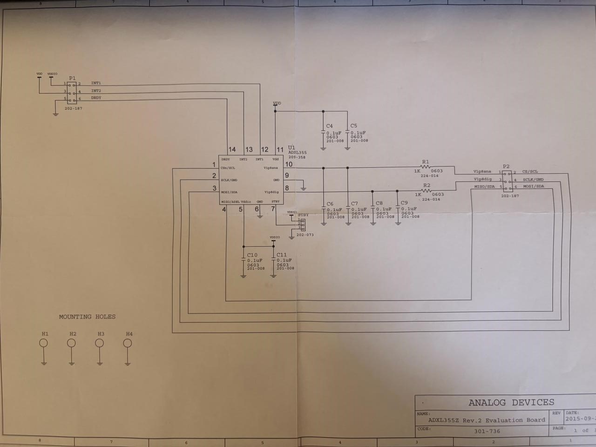

# High-Precision Industrial Tilt Monitoring System
### ADXL355 MEMS Accelerometer + STM32 NUCLEO-L053R8 + Python Industrial Dashboard

<p align="center">


</p>

<p align="center">

</p>

---

# Overview

The **High-Precision Industrial Tilt Monitoring System** is an industry-sponsored embedded systems project developed using the **Analog Devices ADXL355** and **STM32 NUCLEO-L053R8**.

It performs high-precision roll and pitch estimation using a 20-bit MEMS accelerometer, streams processed data over UART, and visualizes measurements through a Python industrial dashboard.

---

# Dashboard

<p align="center">

</p>

---

# Hardware Prototype

<p align="center">

</p>

---

# Wiring Diagram

<p align="center">

</p>

---

# ADXL355 Reference Schematic

<p align="center">

</p>

---

# SPI Connection Table

| STM32 | ADXL355 |
|-------|----------|
| PA4 | P2 Pin1 (CS) |
| PA5 | P2 Pin2 (SCLK) |
| PA6 | P2 Pin3 (MISO) |
| PA7 | P2 Pin4 (MOSI) |
| 3.3V | P1 Pin1 (VDDIO) |
| 3.3V | P1 Pin3 (VDD) |
| GND | P1 Pin5 (GND) |

---

# Features

- Real-time Roll & Pitch Measurement
- Fixed-scale Live Graphs
- UART Telemetry
- CSV Recording
- Industrial Dashboard
- Dark/Light Theme
- STM32 HAL Firmware
- SPI Communication

---

# Architecture

```text
ADXL355 --> SPI --> STM32 --> UART --> Python Dashboard
```

---

# Folder Structure

```text
Industrial-Tilt-Monitoring-System-STM32-ADXL355/
├── Core/
├── Drivers/
├── Dashboard/
├── Images/
│   ├── project_banner.png
│   ├── dashboard.png
│   ├── hardware_prototype.png
│   ├── circuit_diagram.png
│   └── adxl355_reference_schematic.png
├── Documentation/
│   └── Technical_Report.pdf
├── README.md
└── LICENSE
```

---

# Installation

```bash
git clone https://github.com/Aakash03122005/Industrial-Tilt-Monitoring-System-STM32-ADXL355.git
cd Industrial-Tilt-Monitoring-System-STM32-ADXL355/Dashboard
pip install -r requirements.txt
python main.py
```

---

# Documentation

Complete technical documentation is available in:

```
Documentation/Technical_Report.pdf
```

---

# Developed By

**Aakash Dabhade**

B.Tech Electronics & Telecommunication Engineering

Vishwakarma Institute of Technology, Pune

Industry Sponsored Project – TDCoB Pvt. Ltd.

---

⭐ If you found this repository useful, please give it a star!
